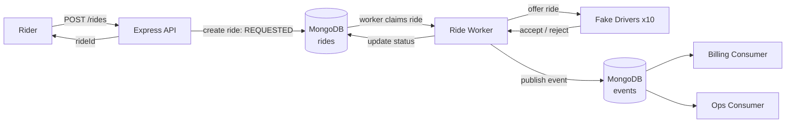
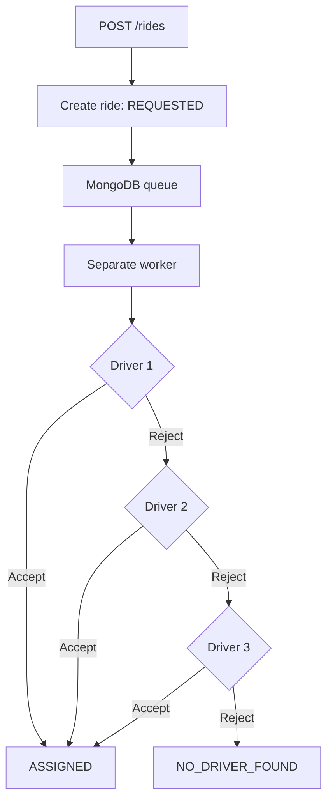

<h1 align="center">🚖 Simple Ride Booking System</h1>

<p align="center">
  A simplified backend implementation of an Ola/Uber-style ride assignment system.<br/>
  Async ride processing · Driver assignment · Event publishing · Independent consumers · 100-ride concurrency test
</p>

<p align="center">
  
  
  
  
  
  
</p>

<p align="center">
  
  
  
  
  
  
  
</p>

---

## 📑 Table of Contents

- [Overview](#-overview)
- [Features](#-features)
- [Assessment Checklist](#-assessment-checklist)
- [Tech Stack](#-tech-stack)
- [Architecture](#-architecture)
- [Project Structure](#-project-structure)
- [Setup](#-setup)
- [Running the System](#-running-the-system)
- [API](#-api)
- [Ride Assignment Flow](#-ride-assignment-flow)
- [Fake Drivers](#-fake-drivers)
- [Event Publishing](#-event-publishing)
- [Event Consumers](#-event-consumers)
- [Testing 100 Rides](#-testing-100-rides)
- [Sample Outputs](#-sample-outputs)
- [Design Notes](#-design-notes)
- [Known Limitations](#-known-limitations)
- [Future Production Improvements](#-future-production-improvements)
- [Author](#-author)

---

## 📌 Overview

This project was built as part of a **Backend Developer Internship assessment**.

A rider books a ride through the API. The API creates the ride and immediately returns a `rideId`. The ride is then processed asynchronously by a **separate worker process**.

The worker offers the ride to hardcoded fake drivers. Each driver randomly accepts or rejects. If a driver accepts, the ride becomes `ASSIGNED`. If three drivers reject, the ride becomes `NO_DRIVER_FOUND`.

Every ride status change is published as an event and stored in MongoDB. Two independent consumer programs, **Billing** and **Ops**, read the same event history, and each one sees **every** event.

---

## ✨ Features

- Book a ride using `POST /rides` and receive a `rideId` immediately
- MongoDB-backed queue for asynchronous ride processing
- Separate Node.js worker process
- 10 hardcoded fake drivers
- Random driver acceptance/rejection (~50% acceptance probability)
- Next driver is tried after a rejection
- Processing stops after 3 driver rejections
- Ride statuses: `REQUESTED`, `ASSIGNED`, `NO_DRIVER_FOUND`
- Event published for every ride status change
- MongoDB event store
- Independent Billing and Ops consumers, both reading the complete event history
- Concurrent test with 100 rides
- Automatic validation of double assignment and stuck rides

---

## ✅ Assessment Checklist

| Requirement | Status | Implementation |
|---|:---:|---|
| `POST /rides` returns `rideId` immediately | ✅ | `rideController.js` |
| Ride is placed into a queue | ✅ | `rideQueue.js` |
| Separate worker processes rides | ✅ | `rideWorker.js` |
| ~10 hardcoded fake drivers | ✅ | `rideWorker.js` |
| ~50% random driver acceptance | ✅ | `rideWorker.js` |
| Rejection → offer to next driver | ✅ | `rideWorker.js` |
| 3 rejections → `NO_DRIVER_FOUND` | ✅ | `rideWorker.js` |
| Event published on status change | ✅ | `eventStore.js` |
| Billing program: "charging rider for ride X" | ✅ | `consumers/billing.js` |
| Ops program: "ride X is now in status Y" | ✅ | `consumers/ops.js` |
| Both consumers see every event | ✅ | MongoDB `events` collection |
| 100 rides booked at once | ✅ | `scripts/create100Rides.js` |
| Total rides created = 100 | ✅ | **100** |
| `ASSIGNED + NO_DRIVER_FOUND` = 100 | ✅ | **87 + 13 = 100** |
| Rides assigned to 2 drivers = 0 | ✅ | **0** |
| Rides stuck with no final status = 0 | ✅ | **0** |

---

## 🛠 Tech Stack

| Layer | Technology |
|---|---|
| Runtime | Node.js |
| Framework | Express.js |
| Database | MongoDB |
| ODM | Mongoose |
| Language | JavaScript |
| API style | REST |
| Version control | Git / GitHub |

---

## 🏗 Architecture



**In short:** API → MongoDB-backed queue → separate worker → driver assignment → MongoDB event store → Billing and Ops consumers (fan-out).

---

## 📁 Project Structure

```text
ride-booking-system/
│
├── src/
│   ├── server.js
│   │
│   ├── models/
│   │   ├── Ride.js
│   │   └── Event.js
│   │
│   ├── routes/
│   │   └── rideRoutes.js
│   │
│   ├── controllers/
│   │   └── rideController.js
│   │
│   ├── queue/
│   │   └── rideQueue.js
│   │
│   ├── workers/
│   │   └── rideWorker.js
│   │
│   ├── events/
│   │   └── eventStore.js
│   │
│   └── consumers/
│       ├── billing.js
│       └── ops.js
│
├── scripts/
│   └── create100Rides.js
│
├── .env
├── .gitignore
├── package.json
└── README.md
```

---

## ⚙️ Setup

### Prerequisites

- Node.js 18+
- A MongoDB connection string (MongoDB Atlas or local MongoDB)

### 1. Clone the repository

```bash
git clone <your-repository-url>
cd ride-booking-system
```

### 2. Install dependencies

```bash
npm install
```

### 3. Configure environment variables

Create a `.env` file in the project root:

```env
PORT=5000
MONGO_URI=your_mongodb_connection_string
```

> ⚠️ Do not commit `.env` to GitHub.

---

## ▶️ Running the System

The system runs as **separate processes**: API, worker, and two consumers. Open four terminals.

| Terminal | Command | Purpose |
|:---:|---|---|
| 1 | `npm run dev` | API server on `http://localhost:5000` |
| 2 | `npm run worker` | Ride worker (claims queued rides and assigns drivers) |
| 3 | `npm run billing` | Billing consumer |
| 4 | `npm run ops` | Ops consumer |

Then, in a fifth terminal, run the test:

```bash
npm run test:100
```

### Available Scripts

| Command | Description |
|---|---|
| `npm run dev` | Start the API server |
| `npm run worker` | Start the ride worker |
| `npm run billing` | Start the Billing consumer |
| `npm run ops` | Start the Ops consumer |
| `npm run test:100` | Create 100 concurrent rides and verify the results |

---

## 🔌 API

### `POST /rides`

Creates a new ride and returns immediately.

**Request**

```http
POST /rides
Content-Type: application/json
```

```json
{
  "riderName": "Ayesha",
  "pickup": "Thane",
  "destination": "Andheri"
}
```

**Response**

```json
{
  "success": true,
  "message": "Ride booked successfully",
  "data": {
    "rideId": "ride_id_here",
    "status": "REQUESTED"
  }
}
```

**Example with cURL**

```bash
curl -X POST http://localhost:5000/rides \
  -H "Content-Type: application/json" \
  -d '{"riderName":"Ayesha","pickup":"Thane","destination":"Andheri"}'
```

### `GET /rides/:rideId`

Returns the current state of a ride.

```http
GET /rides/ride_id_here
```

```json
{
  "success": true,
  "message": "Ride fetched successfully",
  "data": {
    "_id": "ride_id_here",
    "riderName": "Ayesha",
    "pickup": "Thane",
    "destination": "Andheri",
    "status": "ASSIGNED",
    "assignedDriver": "Driver 2"
  }
}
```

---

## 🔄 Ride Assignment Flow



### Ride Statuses

| Status | Meaning |
|---|---|
| `REQUESTED` | Ride created and waiting for the worker |
| `ASSIGNED` | A driver accepted the ride |
| `NO_DRIVER_FOUND` | Three drivers rejected the ride |

---

## 🚗 Fake Drivers

The worker uses 10 hardcoded fake drivers (`Driver 1` to `Driver 10`). Each driver has roughly a **50% chance of accepting** a ride. Drivers are offered the ride **sequentially**, and a maximum of **3 rejections** is allowed per ride.

```text
Driver 1 → REJECT
Driver 2 → ACCEPT        →  ASSIGNED (to Driver 2)
```

```text
Driver 1 → REJECT
Driver 2 → REJECT
Driver 3 → REJECT        →  NO_DRIVER_FOUND
```

Once a ride is assigned, the worker stops offering it to anyone else, so a ride can never end up with two drivers.

---

## 📣 Event Publishing

Every ride status change is published as an event and stored in the MongoDB `events` collection. Each event contains the ride ID, status, and timestamp.

Typical sequences:

```text
REQUESTED → ASSIGNED
REQUESTED → NO_DRIVER_FOUND
```

The worker logs each publish, for example:

```text
Event published: ride 6ac37ebc8bb8ee1b26fc202b -> ASSIGNED
```

---

## 👥 Event Consumers

Two independent programs read the same `events` collection. They **do not delete or consume** events from the database, and each consumer tracks its own processed event IDs. This is **fan-out**, not load-balancing: both consumers receive every event.

```text
              MongoDB events
                    |
           +--------+--------+
           |                 |
           v                 v
    Billing consumer    Ops consumer
```

| Consumer | Command | Behaviour | Output format |
|---|---|---|---|
| **Billing** | `npm run billing` | Charges the rider when a ride reaches `ASSIGNED` | `Billing: charging rider for ride <rideId>` |
| **Ops** | `npm run ops` | Reports ride status events | `Ops: ride <rideId> is now in status <STATUS>` |

---

## 🧪 Testing 100 Rides

```bash
npm run test:100
```

The script:

1. Creates 100 rides concurrently
2. Stores their ride IDs
3. Waits for the worker to process them
4. Checks the final status of every ride
5. Checks for double assignment
6. Checks for stuck rides
7. Prints a summary and PASS/FAIL

### Actual Test Output

```text
PS C:\Users\ayesh\OneDrive\Desktop\ride-booking-system> npm run test:100
Total rides created: 100

====================================
       RIDE BOOKING TEST
====================================
Total rides created:       100
ASSIGNED:                  87
NO_DRIVER_FOUND:           13
Final rides:               100
Double assigned rides:     0
Stuck rides:               0
====================================
PASS: All 100 rides completed successfully.
```

### Validation

| Check | Expected | Actual |
|---|:---:|:---:|
| Total rides created | 100 | **100** |
| `ASSIGNED + NO_DRIVER_FOUND` | 100 | **87 + 13 = 100** |
| Rides assigned to 2 drivers | 0 | **0** |
| Rides stuck with no final status | 0 | **0** |

> The `ASSIGNED` / `NO_DRIVER_FOUND` split varies between runs because driver acceptance is randomized. With three attempts at ~50%, the expected `NO_DRIVER_FOUND` rate is about 12.5% (0.5³), which matches the 13 / 100 observed.

---

## 🖥 Sample Outputs

### Worker

The worker claims a ride, offers it to drivers in order, publishes the event, and assigns the ride.

```text
Processing ride 6ac37ebc8bb8ee1b26fc202b
Driver Driver 1 rejected ride 6ac37ebc8bb8ee1b26fc202b
Driver Driver 2 rejected ride 6ac37ebc8bb8ee1b26fc202b
Event published: ride 6ac37ebc8bb8ee1b26fc202b -> ASSIGNED
Ride 6ac37ebc8bb8ee1b26fc202b assigned to Driver 3

Processing ride 6ac37ebc8bb8ee1b26fc202d
Event published: ride 6ac37ebc8bb8ee1b26fc202d -> ASSIGNED
Ride 6ac37ebc8bb8ee1b26fc202d assigned to Driver 1
```

The second ride was accepted by the first driver, so no rejections occurred.

### Billing consumer

Billing prints a line only for rides that reached `ASSIGNED`:

```text
PS C:\Users\ayesh\OneDrive\Desktop\ride-booking-system> npm run billing
Billing: charging rider for ride 6ac37ebc8bb8ee1b26fc2042
Billing: charging rider for ride 6ac37ebc8bb8ee1b26fc2043
Billing: charging rider for ride 6ac37ebc8bb8ee1b26fc2044
Billing: charging rider for ride 6ac37ebc8bb8ee1b26fc2045
Billing: charging rider for ride 6ac37ebc8bb8ee1b26fc2046
Billing: charging rider for ride 6ac37ebc8bb8ee1b26fc2048
Billing: charging rider for ride 6ac37ebc8bb8ee1b26fc2049
Billing: charging rider for ride 6ac37ebc8bb8ee1b26fc204a
Billing: charging rider for ride 6ac37ebc8bb8ee1b26fc204c
Billing: charging rider for ride 6ac37ebc8bb8ee1b26fc204d
Billing: charging rider for ride 6ac37ebc8bb8ee1b26fc204e
Billing: charging rider for ride 6ac37ebc8bb8ee1b26fc204f
Billing: charging rider for ride 6ac37ebc8bb8ee1b26fc202e
```

Notice that rides `...2047` and `...204b` are **not** charged. They ended in `NO_DRIVER_FOUND`, as the Ops output below confirms.

### Ops consumer

```text
PS C:\Users\ayesh\OneDrive\Desktop\ride-booking-system> npm run ops
Ops: ride 6ac37ebc8bb8ee1b26fc2045 is now in status ASSIGNED
Ops: ride 6ac37ebc8bb8ee1b26fc2046 is now in status ASSIGNED
Ops: ride 6ac37ebc8bb8ee1b26fc2047 is now in status NO_DRIVER_FOUND
Ops: ride 6ac37ebc8bb8ee1b26fc2048 is now in status ASSIGNED
Ops: ride 6ac37ebc8bb8ee1b26fc2049 is now in status ASSIGNED
Ops: ride 6ac37ebc8bb8ee1b26fc204a is now in status ASSIGNED
Ops: ride 6ac37ebc8bb8ee1b26fc204b is now in status NO_DRIVER_FOUND
Ops: ride 6ac37ebc8bb8ee1b26fc204c is now in status ASSIGNED
Ops: ride 6ac37ebc8bb8ee1b26fc204d is now in status ASSIGNED
Ops: ride 6ac37ebc8bb8ee1b26fc204e is now in status ASSIGNED
Ops: ride 6ac37ebc8bb8ee1b26fc204f is now in status ASSIGNED
Ops: ride 6ac37ebc8bb8ee1b26fc202e is now in status ASSIGNED
Ops: ride 6ac37ebc8bb8ee1b26fc202f is now in status NO_DRIVER_FOUND
```

### Fan-out proof

Both consumers read from the same `events` collection and each sees every event relevant to it. For example, ride `6ac37ebc8bb8ee1b26fc2045`:

| Consumer | Output for the ride |
|---|---|
| Billing | `Billing: charging rider for ride 6ac37ebc8bb8ee1b26fc2045` |
| Ops | `Ops: ride 6ac37ebc8bb8ee1b26fc2045 is now in status ASSIGNED` |

Neither consumer took events away from the other.

---

## 🧠 Design Notes

The assessment is time-boxed, so the implementation uses **MongoDB as a simple persistent queue and event store** instead of requiring Redis or a message broker.

### Queue

A ride is available for processing when:

```text
status = REQUESTED
processing = false
```

The worker claims a ride with an atomic MongoDB `findOneAndUpdate()` that sets `processing = true`. Because the claim is atomic, two worker processes cannot pick up the same ride, which also prevents double assignment.

### Event Store

Status events are written to a MongoDB `events` collection. Billing and Ops each read the collection independently and track which events they have already handled, so both observe the full history.

### Current vs Production Architecture

| Concern | Current implementation | Production alternative |
|---|---|---|
| Queue | MongoDB-backed queue | Redis + BullMQ |
| Worker | Separate Node.js process | Distributed workers |
| Event store | MongoDB collection | Kafka / RabbitMQ / Redis Streams |
| Consumer offsets | Processed event IDs per consumer | Consumer groups / offsets |

---

## ⚠️ Known Limitations

- **Mongoose deprecation warning.** The worker logs a warning that the `new` option of `findOneAndUpdate()` is deprecated. It is harmless, and can be removed by replacing `{ new: true }` with `{ returnDocument: 'after' }`.
- **Log wording.** Worker logs print `Driver Driver 1` because the driver name already includes the word "Driver". This is cosmetic.
- **Polling.** The worker and consumers poll MongoDB rather than receiving pushed messages, which adds a small latency.
- **No crash recovery.** If a worker dies after claiming a ride (`processing = true`), that ride stays claimed until it is manually reset.

---

## 🚀 Future Production Improvements

- [ ] Redis + BullMQ for dedicated background job processing
- [ ] Kafka / RabbitMQ / Redis Streams for event delivery
- [ ] Retry handling for failed jobs
- [ ] Dead-letter queues
- [ ] Idempotency keys
- [ ] Distributed workers
- [ ] Driver availability and location tracking
- [ ] Proper transaction and concurrency handling
- [ ] Authentication and authorization
- [ ] Structured logging
- [ ] Monitoring and metrics
- [ ] Automated unit and integration tests
- [ ] Docker-based deployment
- [ ] Graceful worker shutdown and stuck-job recovery

---

## 👩‍💻 Author

**Ayesha Shaikh**
Backend Developer Internship Assessment