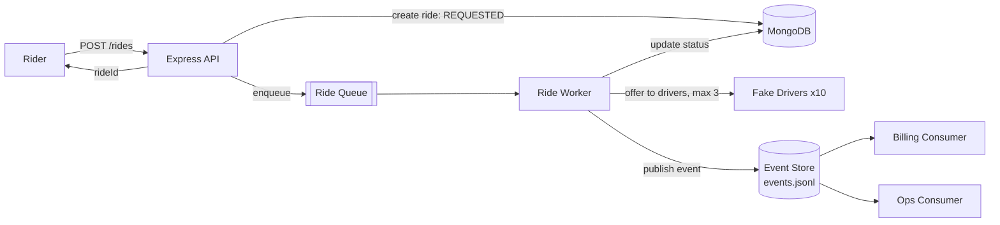
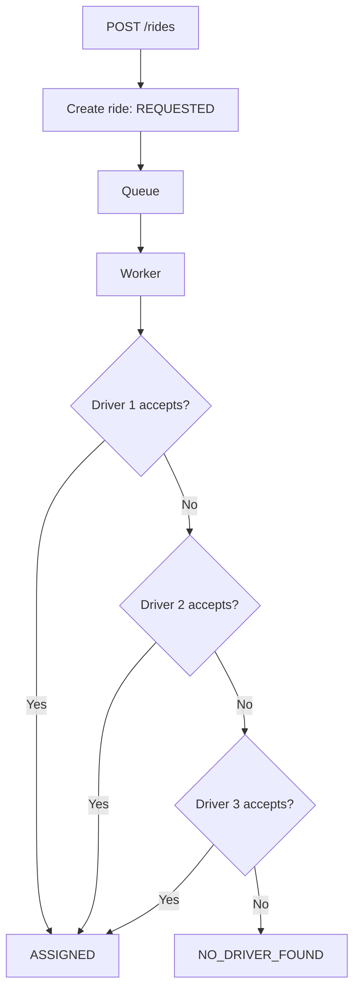

<h1 align="center">🚖 Simple Ride Booking System</h1>

<p align="center">
  A simplified backend implementation of an Ola/Uber-style ride assignment system.<br/>
  Async ride processing · Driver assignment · Event publishing · Independent consumers · 100-ride concurrency test
</p>

<p align="center">
  
  
  
  
  
  
</p>

<p align="center">
  
  
  
  
  
  
</p>

---

## 📑 Table of Contents

- [Overview](#-overview)
- [Features](#-features)
- [Assessment Checklist](#-assessment-checklist)
- [Tech Stack](#-tech-stack)
- [Architecture](#-architecture)
- [Project Structure](#-project-structure)
- [Setup](#-setup)
- [API](#-api)
- [Ride Assignment Flow](#-ride-assignment-flow)
- [Event Publishing](#-event-publishing)
- [Event Consumers](#-event-consumers)
- [Testing 100 Rides](#-testing-100-rides)
- [Design Notes](#-design-notes)
- [Future Production Improvements](#-future-production-improvements)
- [Author](#-author)

---

## 📌 Overview

This project was built as part of a **Backend Developer Internship assessment**. A rider books a ride, the API immediately returns a `rideId`, and a separate worker processes the ride in the background by offering it to fake drivers. Every status change is published as an event that two independent consumers (**Billing** and **Ops**) read in full.

---

## ✨ Features

- Book a ride using `POST /rides` and receive a `rideId` immediately
- Asynchronous ride processing through a queue and a separate worker
- Hardcoded list of 10 fake drivers
- Random driver acceptance/rejection (~50%)
- Next driver is tried after a rejection
- Processing stops after 3 driver rejections
- Ride statuses: `REQUESTED`, `ASSIGNED`, `NO_DRIVER_FOUND`
- An event is published on every status change
- Separate **Billing** and **Ops** consumers, each receiving the complete event history
- Concurrent test with 100 rides and automatic validation

---

## ✅ Assessment Checklist

| Requirement | Status | Where |
|---|:---:|---|
| `POST /rides` returns `rideId` immediately | ✅ | `rideController.js` |
| Ride goes into a queue, picked up by a separate worker | ✅ | `rideQueue.js`, `rideWorker.js` |
| ~10 hardcoded fake drivers, ~50% accept | ✅ | `rideWorker.js` |
| Reject → next driver, 3 rejections → `NO_DRIVER_FOUND` | ✅ | `rideWorker.js` |
| Event published on every status change | ✅ | `eventStore.js` |
| Billing program prints "charging rider for ride X" | ✅ | `consumers/billing.js` |
| Ops program prints "ride X is now in status Y" | ✅ | `consumers/ops.js` |
| Both consumers see **every** event (fan-out, not split) | ✅ | `eventStore.js` |
| Script books 100 rides at once | ✅ | `scripts/create100Rides.js` |
| Total created = 100 | ✅ | test output |
| `ASSIGNED + NO_DRIVER_FOUND = 100` | ✅ | test output |
| Rides assigned to 2 drivers = 0 | ✅ | test output |
| Rides stuck with no final status = 0 | ✅ | test output |

---

## 🛠 Tech Stack

| Layer | Technology |
|---|---|
| Runtime | Node.js |
| Framework | Express.js |
| Database | MongoDB |
| ODM | Mongoose |
| Language | JavaScript |
| Version Control | Git / GitHub |

---

## 🏗 Architecture



---

## 📁 Project Structure

```text
ride-booking-system/
│
├── src/
│   ├── server.js
│   │
│   ├── models/
│   │   └── Ride.js
│   │
│   ├── routes/
│   │   └── rideRoutes.js
│   │
│   ├── controllers/
│   │   └── rideController.js
│   │
│   ├── queue/
│   │   └── rideQueue.js
│   │
│   ├── workers/
│   │   └── rideWorker.js
│   │
│   ├── events/
│   │   └── eventStore.js
│   │
│   └── consumers/
│       ├── billing.js
│       └── ops.js
│
├── scripts/
│   └── create100Rides.js
│
├── .env
├── .gitignore
├── package.json
└── README.md
```

---

## ⚙️ Setup

### Prerequisites

- Node.js 18+
- A MongoDB connection string (local or MongoDB Atlas)

### 1. Clone the repository

```bash
git clone <your-repository-url>
cd ride-booking-system
```

### 2. Install dependencies

```bash
npm install
```

### 3. Configure environment variables

Create a `.env` file in the project root:

```env
PORT=5000
MONGO_URI=your_mongodb_connection_string
```

> ⚠️ Do not commit `.env` to GitHub.

### 4. Start the server

```bash
npm run dev
```

The server runs on `http://localhost:5000`.

### Available Scripts

| Command | Description |
|---|---|
| `npm run dev` | Start the API server and ride worker |
| `npm run billing` | Start the Billing consumer |
| `npm run ops` | Start the Ops consumer |
| `npm run test:100` | Create and verify 100 concurrent rides |

---

## 🔌 API

### `POST /rides`

Creates a new ride.

**Request**

```http
POST /rides
Content-Type: application/json
```

```json
{
  "riderName": "Ayesha",
  "pickup": "Thane",
  "destination": "Andheri"
}
```

**Response**

```json
{
  "success": true,
  "message": "Ride booked successfully",
  "data": {
    "rideId": "ride_id_here",
    "status": "REQUESTED"
  }
}
```

The API returns the ride ID immediately. Ride processing happens after the ride is added to the queue.

**Example with cURL**

```bash
curl -X POST http://localhost:5000/rides \
  -H "Content-Type: application/json" \
  -d '{"riderName":"Ayesha","pickup":"Thane","destination":"Andheri"}'
```

---

## 🔄 Ride Assignment Flow



### Ride Statuses

| Status | Meaning |
|---|---|
| `REQUESTED` | Ride created and queued |
| `ASSIGNED` | A driver accepted the ride |
| `NO_DRIVER_FOUND` | 3 drivers rejected the ride |

---

## 🚗 Fake Drivers

The system uses 10 hardcoded drivers (`Driver 1` to `Driver 10`). Each driver has approximately a **50% chance** of accepting a ride. A maximum of **3 driver rejections** is allowed per ride.

---

## 📣 Event Publishing

Whenever a ride status changes, an event is published and appended to:

```text
data/events.jsonl
```

Typical event sequences:

```text
REQUESTED → ASSIGNED
REQUESTED → NO_DRIVER_FOUND
```

The generated `data/` directory is excluded from Git using `.gitignore`.

---

## 👥 Event Consumers

Two independent consumers read the **same** event history. Each keeps its own read position, so one consumer never removes or steals events from the other (fan-out, not load-balancing).

| Consumer | Command | Handles | Output |
|---|---|---|---|
| **Billing** | `npm run billing` | `ASSIGNED` events | `Billing: charging rider for ride <rideId>` |
| **Ops** | `npm run ops` | All status events | `Ops: ride <rideId> is now in status <STATUS>` |

**Ops example output**

```text
Ops: ride <rideId> is now in status REQUESTED
Ops: ride <rideId> is now in status ASSIGNED
Ops: ride <rideId> is now in status NO_DRIVER_FOUND
```

---

## 🧪 Testing 100 Rides

```bash
npm run test:100
```

The script creates 100 rides concurrently, waits for processing to finish, and prints a summary.

**Example output**

```text
====================================
       RIDE BOOKING TEST
====================================
Total rides created:       100
ASSIGNED:                  89
NO_DRIVER_FOUND:           11
Final rides:               100
Rides assigned to 2 drivers: 0
Stuck rides:               0
====================================
PASS: All 100 rides completed successfully.
```

The exact `ASSIGNED` and `NO_DRIVER_FOUND` values vary because driver acceptance is randomized.

### Validation

| Check | Expected |
|---|:---:|
| Total rides created | 100 |
| `ASSIGNED + NO_DRIVER_FOUND` | 100 |
| Rides assigned to 2 drivers | 0 |
| Rides stuck with no final status | 0 |

---

## 🧠 Design Notes

The assessment is time-boxed, so the queue and event fan-out use lightweight Node.js primitives instead of requiring an external Redis installation.

| Concern | Current implementation | Production replacement |
|---|---|---|
| Queue (`src/queue/rideQueue.js`) | In-memory queue | BullMQ / Redis |
| Worker (`src/workers/rideWorker.js`) | Single-process worker | Distributed workers |
| Events (`src/events/eventStore.js`) | Append-only JSONL file | Redis Pub/Sub, RabbitMQ, or Kafka |

Each piece is isolated behind its own module, so it can be swapped out without changing the API contract.

---

## 🚀 Future Production Improvements

- [ ] Redis + BullMQ for durable background jobs
- [ ] Redis Pub/Sub, RabbitMQ, or Kafka for event delivery
- [ ] Retry handling for failed jobs
- [ ] Dead-letter queues
- [ ] Idempotency to prevent duplicate processing
- [ ] Distributed workers
- [ ] Driver location and availability tracking
- [ ] Proper transaction/concurrency handling
- [ ] Authentication and authorization
- [ ] Structured logging and monitoring
- [ ] Automated unit/integration tests
- [ ] Docker-based deployment

---

## 👩‍💻 Author

**Ayesha Shaikh**
Backend Developer Intern Assessment